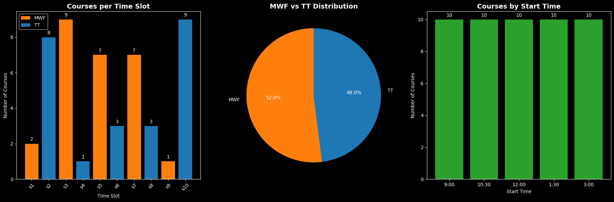
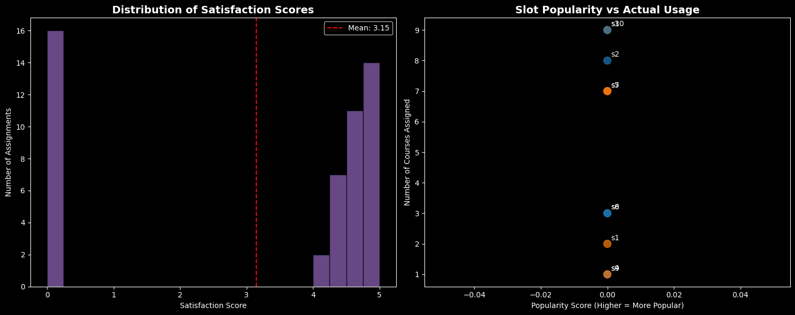
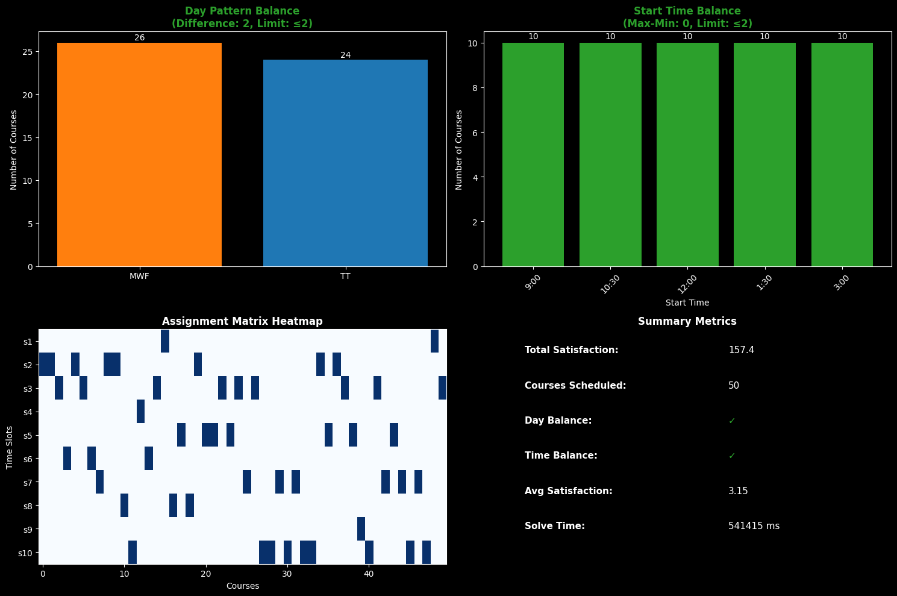

# A programmatic solution for the optimization of course scheduling

[](https://opensource.org/licenses/MIT)
[](https://www.python.org)

This repository explores a programmatic solution for assigning lecture courses to time slots, specifically tailored to the [scheduling regulations](https://registrar.fas.harvard.edu/fas-schedule) adopted by Harvard’s Faculty of Arts and Sciences (FAS) [starting in Fall 2018](https://www.thecrimson.com/article/2017/3/8/faculty-debate-schedule-proposal/). The code implements a combinatorial optimization approach to ensure fairness, compliance with institutional constraints, and maximization of faculty satisfaction.

# Problem and context

Harvard’s FAS scheduling rules require that:

- Courses meeting more than once per week shall be scheduled in the Monday-Wednesday-Friday (MWF) sequence or the Tuesday-Thursday (TT) sequence.
- No class shall start at a time other than the designated class start times.
- Each department must ensure that courses are balanced between MWF and TT sequences, with no more than a two-course difference between them.
- Each department must ensure the difference between the most and least used start times must not exceed two courses.
- Members of the voting faculty are not allowed to teach Tuesdays from 3:00pm to 5:00pm as that would conflict with FAS faculty meetings.

In addition, the Department of History will seek to accommodate faculty preferences to the greatest extent possible. This will be accomplished by polling faculty members about their preferences ahead of each semester. In the poll, faculty will be asked to rank their slot preferences for each course.

It is unlikely that all of their first preferences could be accommodated while also fulfilling the new regulations. Finding the best solution can be formulated as a combinatorial optimisation problem, specifically a variant of the [*generalized assignment problem*](https://en.wikipedia.org/wiki/Generalized_assignment_problem). The goal is to assign each course to a time slot such that all constraints are satisfied and faculty preferences are considered to the maximum extent possible.

# Modelling and mathematical formulation

Let $C = \{c_1, c_2, \ldots, c_n\}$ be the set of courses to be scheduled and $T = \{t_1, t_2, \ldots, t_{10}\}$ the set of 10 available time slots between 9:00am and 4:15pm. Here, $c \in C$ and $t \in T$. $M = \{t_1, t_3, t_5, t_7, t_9\}$ represents the subset of time slots following MWF pattern and $H = \{t_2, t_4, t_6, t_8, t_{10}\}$ those following TT pattern.

For slot popularity, we use [Kendall's Tau](https://en.wikipedia.org/wiki/Kendall_rank_correlation_coefficient) distance to find the [Kemeny-Young consensus ranking](https://en.wikipedia.org/wiki/Kemeny–Young_method) that minimizes disagreement across all faculty preferences.

The *satisfaction score* $s_{c,t}$ for assigning course $c$ to slot $t$ is calculated as:

$$
s_{c,t} = \begin{cases} 
0 & \text{if } p_{c,t} = 0 \text{ (unavailable)} \\
\max\bigl(0,\,(5 - p_{c,t}) \;-\; \text{popularity}(t) \;+\; \epsilon\bigr) & \text{otherwise}
\end{cases}
$$

where **$p_{c,t}\in\{0,1,\ldots,10\}$** with $p_{c,t} = 0$ meaning “unavailable” and $p_{c,t} = 1$ meaning “most preferred,” up to $10$ (least preferred). The random tie-breaker $\epsilon \sim \text{Uniform}(0.1, 1.0)$ offsets equal preferences, and $\text{popularity}(t)$ is the normalized penalty.

$x_{c,t}$ is a binary variable that takes the value $1$ if course $c$ is assigned to slot $t$ and $0$ otherwise. Let $K = \{1,2,3,4,5\}$ represent the five start times (9:00, 10:30, 12:00, 1:30, 3:00), and $T_k \subset T$ the slots associated with each start time $k$. Let $V \subseteq C$ be the set of courses taught by voting faculty, and $t_{10}$ the Tuesday 3:00-4:15 pm slot. The optimization problem is formulated as:

$$\begin{aligned}
\text{maximize } & \sum_{c \in C} \sum_{t \in T} s_{c,t} \cdot x_{c,t} \\
\text{subject to } & \sum_{t \in T} x_{c,t} = 1 \quad \forall c \in C,  && \text{course assigned to exactly one time slot}\\
& \left| \sum_{c \in C} \sum_{t \in M} x_{c,t} - \sum_{c \in C} \sum_{t \in H} x_{c,t} \right| \leq 2, && \text{MWF/TT difference cannot exceed 2}\\
& \max_{k \in K} \sum_{t \in T_k} \sum_{c \in C} x_{c,t} - \min_{k \in K} \sum_{t \in T_k} \sum_{c \in C} x_{c,t} \leq 2, && \text{least/most used slot difference cannot exceed 2}\\
& \sum_{c \in V} x_{c,t_{10}} = 0, && \text{cannot assign voting faculty to T 3-5pm slot }\\
& x_{c,t} \in \{0,1\} \quad \forall (c,t) \in C \times T.
\end{aligned}$$

# Technical Implementation

The solution, as implemented in [`scheduling.ipynb`](scheduling.ipynb) follows these steps:

- **1. Data ingestion:** Load faculty preferences, course-faculty mappings, and faculty metadata from CSV files.
- **2. Slot definition:** Define 10 time slots (9:00-15:00) grouped by day pattern (MWF/TT) and start time.
- **3. Slot popularity calculation:** Use Kemeny-Young consensus ranking to determine slot popularity from faculty preferences.
- **4. Satisfaction matrix construction:** For each course-slot pair, compute satisfaction using:
   - Base satisfaction: $(5 - p_{c,t})$ where $p_{c,t}$ is preference rank
   - Popularity penalty: subtract slot popularity score derived from Kemeny-Young consensus
   - Tie-breaking: add random value $\epsilon \sim \text{Uniform}(0.1, 1.0)$
   - Clamp to non-negative values: $s_{c,t} = \max(0, \text{base} - \text{penalty} + \epsilon)$
- **5. MIP solver:** Use [Google OR-Tools](https://developers.google.com/optimization/) *Coin-or branch and cut* (CBC) mixed integer programming solver to maximize total satisfaction. The absolute value and min/max constraints in the mathematical formulation are linearized using standard MIP techniques:
   - Absolute value constraint $|A - B| \leq 2$ becomes: $A - B \leq 2 \text{ and } B - A \leq 2$
   - Min/max constraint becomes individual constraints for each start time: $\sum_{t \in T_k} \sum_{c \in C} x_{c,t} \geq \text{stime-min} \text{ and } \sum_{t \in T_k} \sum_{c \in C} x_{c,t} \leq \text{stime-max}$

- **6. Solution extraction and visualization:** Output assignment matrix and verify constraint satisfaction.

# Analysis and visualization of the results

[`scheduling.ipynb`](scheduling.ipynb) generates comprehensive visualizations to analyze the optimization results:

### Course Distribution Analysis
- **Slot Usage Chart:** Shows courses per time slot, color-coded by MWF/TT pattern
- **Day Pattern Distribution:** Pie chart showing MWF vs TT balance
- **Start Time Distribution:** Bar chart showing course distribution across start times



### Satisfaction Analysis
- **Satisfaction Score Histogram:** Distribution of satisfaction scores across all assignments
- **Popularity vs Usage Scatter Plot:** Relationship between slot popularity and actual usage



### Constraint Compliance Dashboard
- **Balance Verification:** Visual confirmation of MWF/TT and start time balance constraints
- **Assignment Heatmap:** Visual representation of the final course-slot assignment matrix
- **Summary Metrics:** Key performance indicators including total satisfaction, constraint compliance, and solve time



# Sample Data

Anonymized sample data is included in the `data` directory:

1. **selections.csv:** Faculty preference matrix (courses × time slots) with rankings 1-10 where 1 = most preferred, 10 = least preferred. Value 0 indicates the faculty member is unavailable in that slot.
2. **courses.csv:** Course-faculty mapping with columns: Course, Faculty  
3. **faculty.csv:** Faculty metadata with columns: Faculty, Adjustment, Voting (1=voting faculty, 0=non-voting)

The sample dataset contains 45 courses taught by 18 faculty members across 10 time slots.

# Application

A complete web-based implementation is provided as a [Dash](https://dash.plotly.com) application:


## Running the Application

1. **Install dependencies:**
   ```shell
   pip install -r requirements.txt
   ```

2. **Start the application:**
   ```shell
   python ./app/app.py
   ```

3. **Load data files:**
   - Upload faculty data (faculty.csv)
   - Upload course-faculty mapping (courses.csv) 
   - Upload preference selections (selections.csv)

4. **Run optimization:**
   - Click "Calculate" to run the scheduling optimization
   - View results, constraint compliance, and visualizations

The app will be available at [`http://127.0.0.1:8050`](http://127.0.0.1:8050) in your browser.

## License

The project is licensed under the [MIT License](LICENSE), allowing free use, modification, and distribution.
